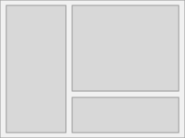
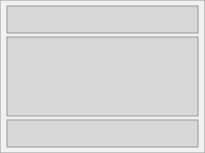
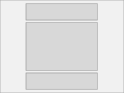
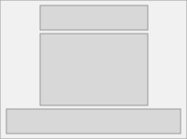
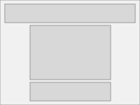

# Layout

The Sass partials in this directory provide a basic wireframe layout for the header, page-wrapper and footer.
There are currently 5 basic layout options available, they should cover most use cases.

Only one of these should be imported in any project (Maybe one day there will be some checking to ensure one (and only one) has been imported).

## Side Menu
like avenue

## Full Bleed
top menu, stripes of content that stretch 100% width. Works nice with the full bleed pagebuilder option

## Inner Contained
top menu, all content and background colours are contained within the templates max width.

## Footer Bleed
a bit like "inner contained" but with a full width (but constrained) footer - top menu, like picnic

## Header Bleed
a bit like "inner contained" but with a full width header - top menu, like metro

